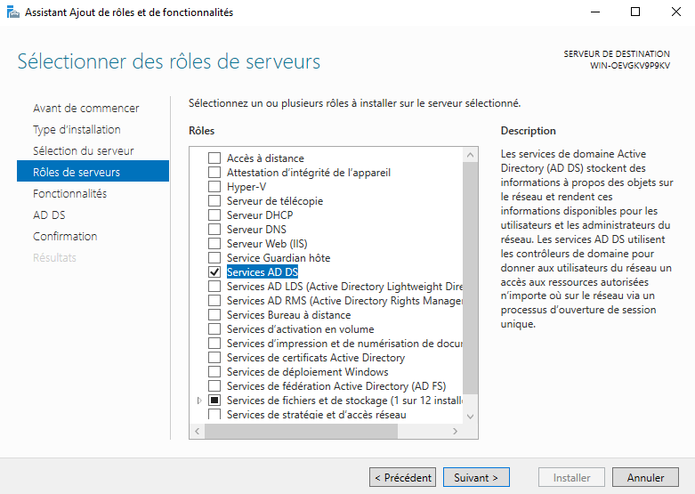
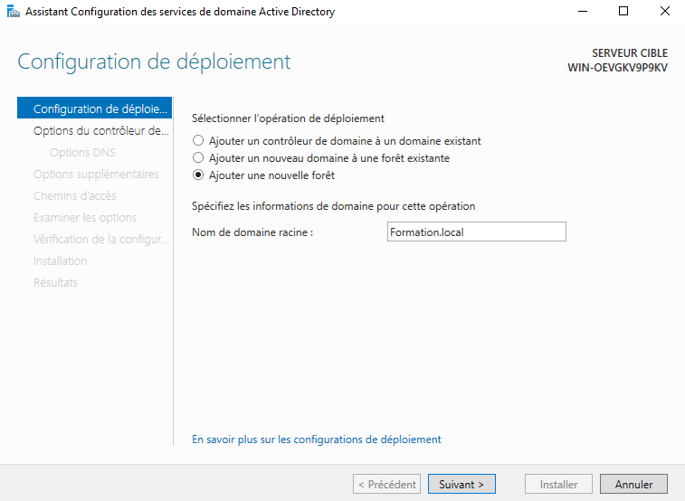

# **Ajout du role AD-DS sur AD1**

Le service AD DS (Active Directory Domain Services) est le rôle de serveur qui fournit les fonctions principales d'Active Directory dans un environnement Windows.
Son objectif est de centraliser la gestion des utilisateurs, des ordinateurs, des groupes et des ressources d'un réseau.
Les principales fonctions d'AD DS

Authentification

Vérifie l'identité des utilisateurs et des ordinateurs lors de la connexion au domaine.
Utilise principalement les protocoles Kerberos et LDAP.

Exemple :
Un employé saisit son nom d'utilisateur et son mot de passe sur son PC. AD DS vérifie ces informations et autorise (ou refuse) la connexion.

Autorisation

Détermine les ressources auxquelles un utilisateur peut accéder.
S'appuie sur les groupes de sécurité et les permissions.

Application des stratégies de groupe (GPO)
AD DS permet de déployer automatiquement des paramètres de sécurité et de configuration.

Exemples :

- Imposer une longueur minimale des mots de passe
- Interdire l'accès au panneau de configuration
- Installer automatiquement des logiciels
- Configurer les lecteurs réseau
- Réplication
- Lorsqu'il existe plusieurs contrôleurs de domaine, AD DS réplique automatiquement les informations entre eux afin que tous disposent des mêmes données

Pour commencer nous allons ajouter le role AD-DS sur AD1 :

Cela va nous permette de pouvoir :
- Stocker les comptes utilisateurs, les groupes, les machines
- Gèrer la sécurité, les stratégies de groupe (GPO), l’authentification Kerberos
- Et de créer une forêt, un domaine, des OU

Une fois la fonctionnalité ajouter, nous pouvons cliquer sur le drapeau et sur "Promouvoir ce serveur en contrôleur de domaine"
Nous allons ensuite crée une nouvelle foret que nous appellerons Formation.local :

Ensuite suivez les étape suivant et a la fin  de l'installation le serveur redémarrera
