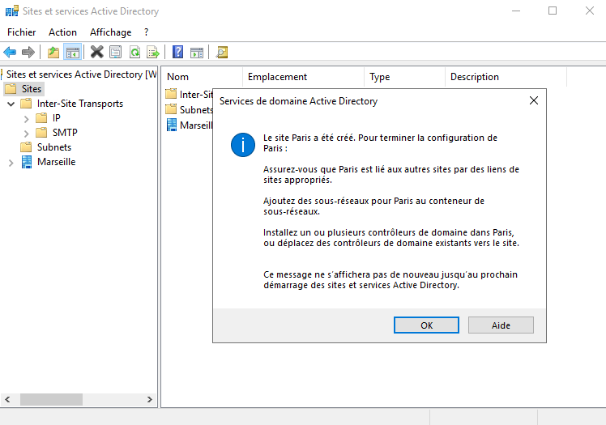
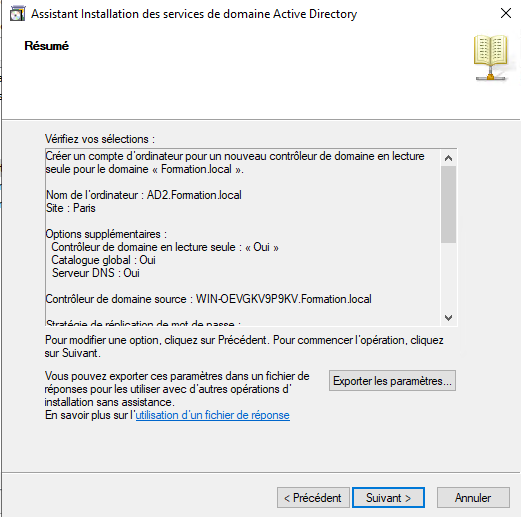
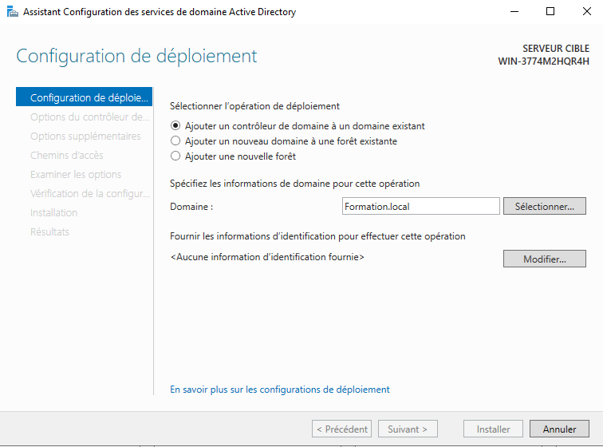
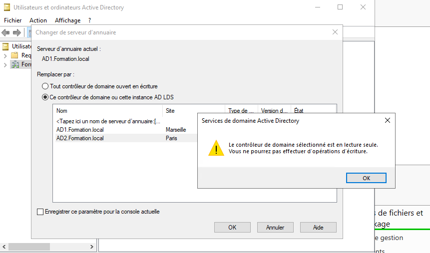
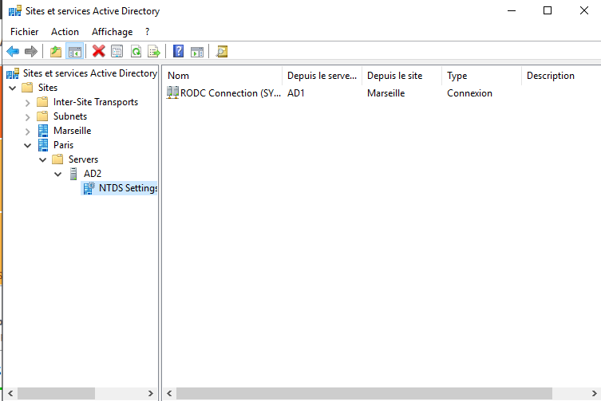
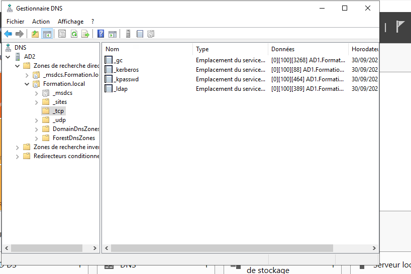
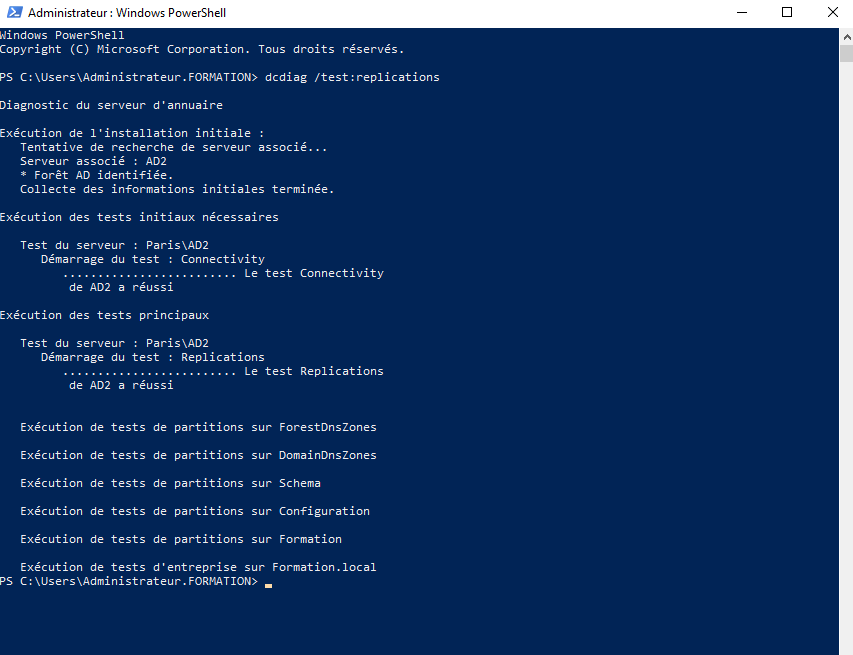

Le RODC été introduit avec Windows Server 2008 pour améliorer la sécurité, notamment dans les sites distants où la sécurité physique des serveurs ne peut pas être garantie.

Un RODC permet aux utilisateurs d'un site distant de :

- S'authentifier auprès du domaine 
- consulter les informations de l'Active Directory 
- Bénéficier de performances locales pour les connexions

En revanche, il ne peut pas modifier les données de l'Active Directory. Toute modification (création d'utilisateurs, changement de mot de passe, modification de groupes, etc.) doit être effectuée sur un contrôleur de domaine classique (en lecture/écriture).

Caractéristiques principales
Base Active Directory en lecture seule, ce qui veux dire que les modifications ne sont jamais écrites directement sur le RODC.
Réplication à sens unique, le RODC reçoit les mises à jour depuis un contrôleur de domaine principal, mais n'en envoie pas.
Cache sélectif des mots de passe, par défaut, les mots de passe des utilisateurs ne sont pas stockés sur le RODC. Un administrateur peut définir une politique indiquant quels comptes peuvent être mis en cache.
Sécurité renforcée : si le serveur est volé ou compromis, le risque est limité, car il ne contient pas nécessairement tous les secrets du domaine.
Cas d'utilisation

Un RODC est particulièrement adapté pour :

- Une agence distante
- Une succursale avec peu de personnel informatique
- Un site où le serveur n'est pas suffisamment protégé physiquement

# **Installation d'un RODC sur AD2**
Dans Site et service Active directory, j'ai renommé le site par défaut par le nom "Marseille" et j'ai crée un autre site avec le nom de "Paris" (ce site sera attribué au serveur AD2 qui sera en lecture seul)

Sur AD1 dans Utilisateur et Ordinateur Active Directory, j'ai crée au préalable un compte de contrôleur de domaine en lecture seul :

Ensuite sur AD2, j'ai ajouter le rôle AD-DS et j'ai ajouter le contrôleur de domaine au domaine existant "Formation.local"

Puis j'ai vérifier dans "Utilisateur et Ordinateur Active Directory" que AD2 était bien lecteur seul 

# **Vérification a réaliser après l'installation d'un contrôleur de domaine**

L'installation d'un contrôleur de domaine terminée, il peut être utile de vérifier les points suivants :
- la bonne configuration des sites AD.
- La configuration de la réplication intersites.
- La bonne configuration de la zone DNS.
- L'association des sous-réseaux IP avec les bon sites.

Vérifier la présence des enregistrement de type SRV dans le DNS :

On peut aussi exécuter la commande dcdiag /test:replication afin de s'assurer de la bonne réplication entre AD1 et AD2

