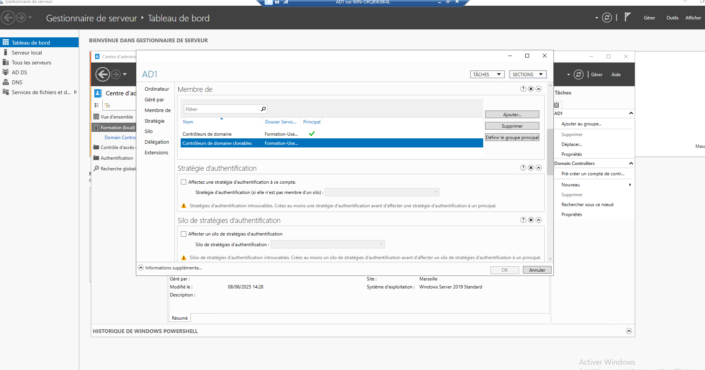
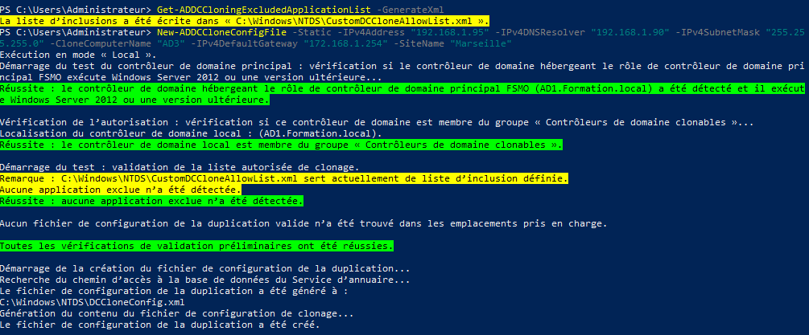
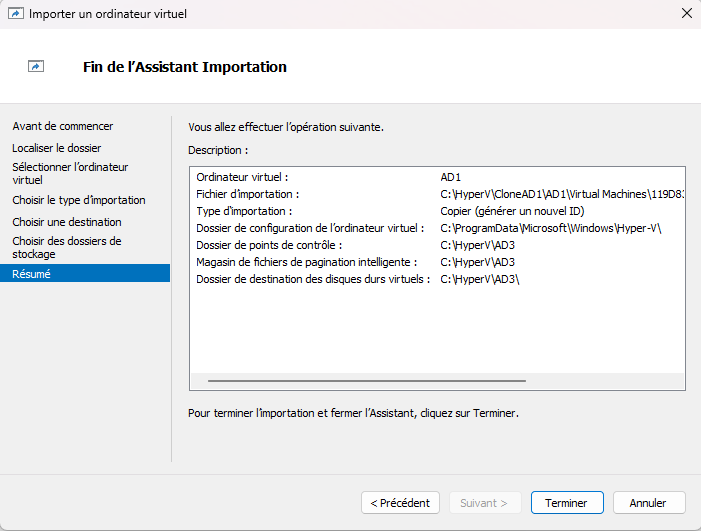

# **Clonage AD1**

Le clonage permet de créer rapidement un nouveau contrôleur de domaine à partir d'un contrôleur de domaine existant, au lieu de refaire toute l'installation et la promotion manuellement.

Par exemple :

Une entreprise possède un contrôleur de domaine virtuel nommé DC01.
Elle veut créer plusieurs contrôleurs de domaine supplémentaires.
Elle clone DC01.
Le nouveau serveur devient automatiquement un nouveau contrôleur de domaine avec une identité propre.

Cela permet donc 
- Un déploiement rapide qui évite de réinstaller Windows Server et de refaire toutes les étapes de promotion AD DS.
- Utile dans les environnements virtualisés, particulièrement adapté aux infrastructures utilisant des hyperviseurs compatibles.
- Facilite les extensions d'infrastructure, particulièrement intéressant lors de l'ouverture de nouveaux sites ou de l'ajout de capacité.
- Réduit les erreurs humaines car les paramètres validés du contrôleur existant servent de modèle.

Pour commencer il suffit d'ajouter le contrôleur de domaine dans le groupe `Contrôleur de domaine clonable` :

Ensuite il est nécessaire de redémarrer le serveur afin que l'ajout au groupe soit prit en compte.

Puis il faut exécuter la commande `Get-ADDCCloningExcludedApplicationList` afin d'identifier toutes les programmes et services qui ne sont pas compatible avec le clonage

De notre coté aucun programme ou service ne posera problème donc nous pouvons ensuite utiliser la commande `New-ADDCCloneConfigFile` pour configurer ça création. Il est possible de lui attribuer directement une adresse IP fixe, un nom, une route par défaut et son nom de site :

Ensuite arrêter le serveur AD1, même si une exportions de la VM est possible sans avoir à l'éteindre, dans un cas de clonage il est préférable de le faire.
Ensuite exportez AD1, dans le dossier C:\CloneAD1. Pour cela, il suffit de faire un clique droit sur AD1, et cliquez sur exporter.
Ensuite on clique sur "Importer un ordinateur virtuel", on sélectionne le dossier CloneAD1,dans le choix du type d'importation on sélectionne l'option "Copier l'ordinateur virtuel (créer un ID unique) et pour l'emplacement on sélectionne un autre emplacement que celui proposer par défaut afin d'éviter d'éventuels conflit lié au nom en double

Une fois la création effectué vous pouvez lancer la machine.
