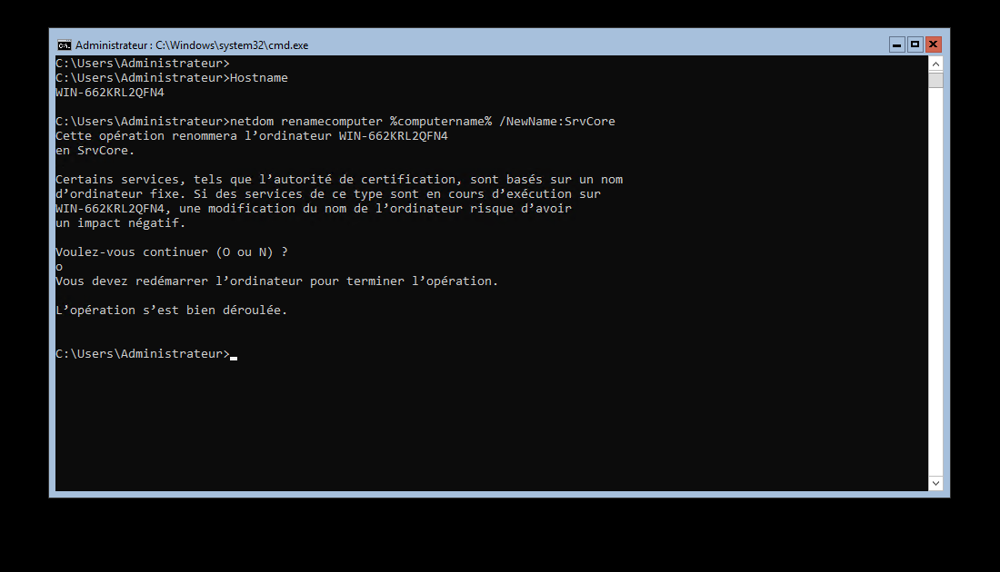
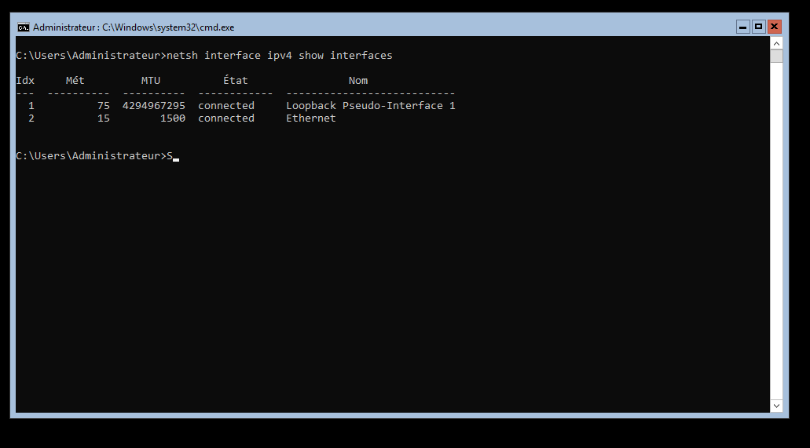
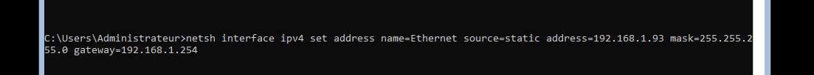
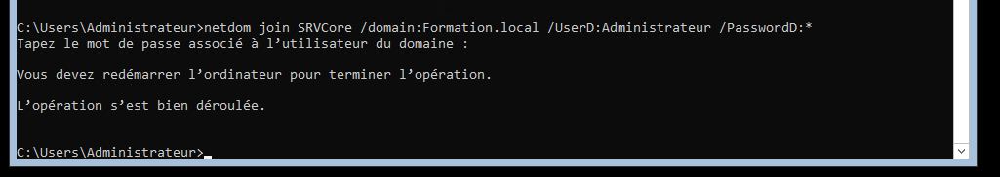
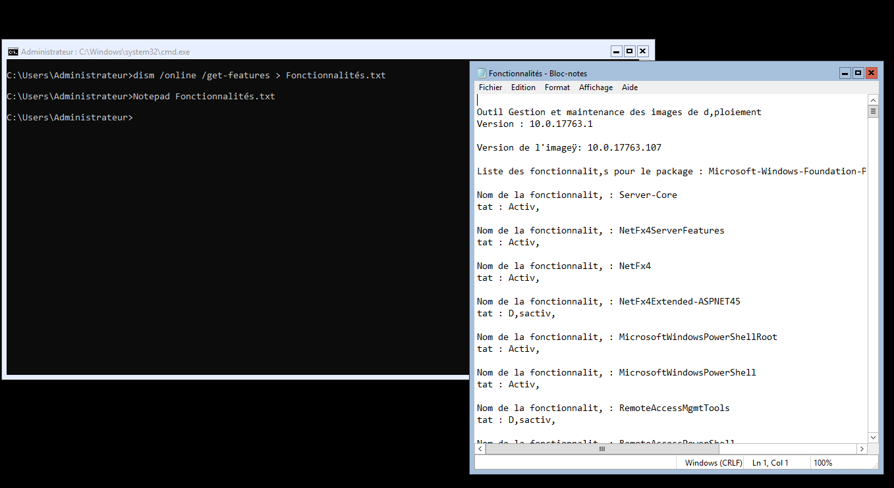

# **SRV-Core**

Pour modifier le nom de la machine, saisissez cette commande :

'netdom renamecomputer %computername% /NewName:SrvCore'

Ensuite il est nécessaire d'effectuer un redémarrage de la machine pour la modification soit prise en compte.
Pour cela, taper cette commande : 'shutdown -r -t 0'

Le commutateur -r indique un redémarrage du serveur -t 0 signifie de manière immédiate

Ensuite pour la configuration de la carte réseau il est tout d'abord nécessaire de récupérer son nom : 'netsh interface ipv4 show interfaces'

Nous allons maintenant pouvoir lui configurer une adresse IP grâce a cette commande : 
'''cmd
netsh interface ipv4 set address name="Ethernet" source=static address=192.168.1.93 mask=255.255.255.0 gateway=192.168.1.254
'''

Il faut aussi penser a configurer l'adresse DNS avec cette commande : 'netsh interface ip set dns "Ethernet" static 192.168.1.90 primary'

Ensuite nous allons ajouter le serveur au domaine : 'netdom join SRVCore /domain:Formation.local /UserD:Administrateur /PasswordD:*'

# **Installation de rôle avec une installation en mode Core**
Le serveur ne possédant pas d'interface graphique, L'installation doit donc s'effectuer en ligne de commande. Il faut donc utiliser la commande 'dism' pour lister , activer ou supprimer une fonctionnalité du système d'exploitation.

'dism /online /get-features > Fonctionnalités.txt'

Le commutateur 'Online' permet de voir les fonctionnalité disponible dans le système d'exploitation en cours d'exécution, le commutateur 'get-features' permet de précisé ceux qui sont répertorié. Et le résultat est ensuite écrit dans le fichier Fonctionnalité.txt.
Ensuite il nous suffit d'ouvrir le fichier avec Notepad

