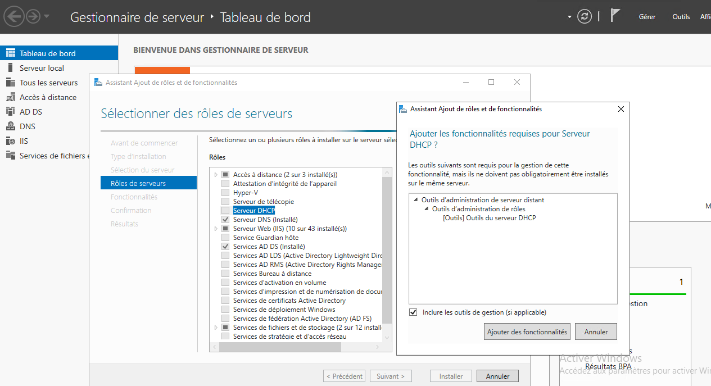
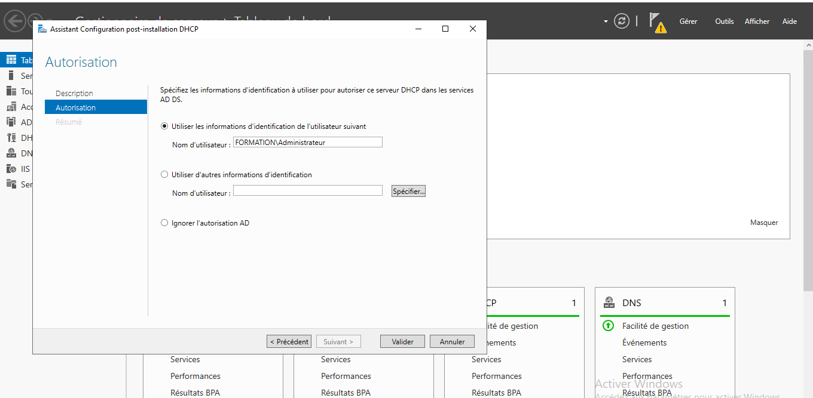
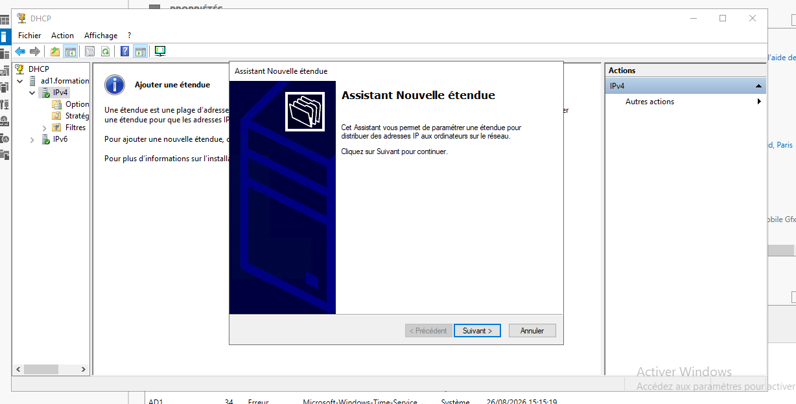
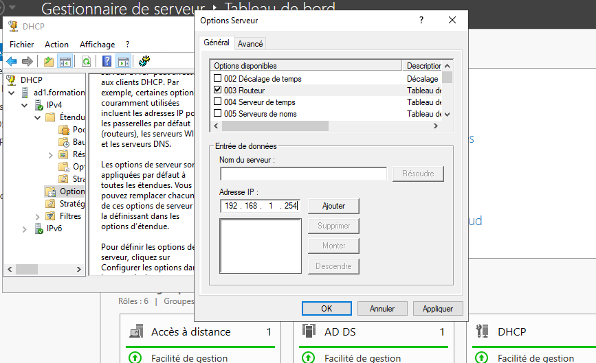

# **1-Rôle et fonctionnement du service DHCP**

DHCP (Dynamic Host Configuration Protocol) est un protocole qui permet d’assurer la configuration automatique des 
interfaces réseaux. Cette configuration comprend une adresse IP, un masque de sousréseau mais également une 
passerelle et des serveurs DNS. D’autres paramètres supplémentaires peuvent être distribués (serveur WINS…). 

Au vue de la taille des réseaux actuels, il est souvent nécessaire de remplacer l’adressage statique saisi par un 
administrateur sur chaque machine par un adressage dynamique effectué par le biais du serveur DHCP. Ce dernier 
offre l’avantage d’offrir une configuration à chaque machine qui en fait la demande, de plus il est impossible de 
distribuer deux adresses IP identiques. Le conflit IP est donc évité. L’administration s’en trouve également facilitée. 

Le serveur est capable d’effectuer une distribution de configuration IPv4 ou IPv6. 

L’opération d’affectation d’une adresse IP passe par l’échange de plusieurs trames entre le client et le serveur. 
La machine envoie à l’aide d’une diffusion (envoi d’un broadcast), un datagramme (DHCP Discover) sur le port 67.  
Tout serveur qui reçoit ce datagramme diffuse une offre DHCP au client (DHCP Offer). Le port utilisé pour l’offre est le 
68.  

Le client retient la première offre qu’il reçoit et diffuse sur le réseau un datagramme (DHCP Request), il contient 
l’adresse IP du serveur et celle qui vient d’être proposée au client. Le serveur retenu reçoit une demande 
d’assignation de l’adresse alors que les autres serveurs sont avertis qu’ils n’ont pas été retenus. 
Le serveur envoie un datagramme d’accusé de réception (DHCP ACK  Acknowledgement) qui assigne au client 
l’adresse IP et son masque de sousréseau ainsi que la durée du bail et éventuellement d’autres paramètres 
(passerelle, DNS…). 

La liste des options que le serveur DHCP peut accepter est définie dans la RFC 2134. 
Un bail DHCP (configuration attribuée à un poste) a une durée de validité définie par l’administrateur. À 50 % de la 
durée du bail, le client commence à demander son renouvellement. Cette demande est faite uniquement au serveur 
qui a attribué le bail. Si ce dernier n’a pas été renouvelé, la prochaine demande s’effectuera à 87,5 % de la durée. 
Arrivée à son terme, et si le client n’a pas pu obtenir de renouvellement ou une nouvelle allocation, l’adresse est 
désactivée. Ainsi la faculté d’utiliser le réseau local est perdue.

# **2-Installation et configuration du rôle DHCP**

Comme pour les autres rôles, DHCP s’installe depuis la console Gestionnaire de serveur. 

- On Ouvre la console Gestionnaire de serveur et on clique sur Ajouter des rôles et des fonctionnalités. 
- Dans la fenêtre on sélectionne le type d’installation, on laisse le choix par défaut.
- On séléctionne le rôle Serveur DHCP. On clique ensuite sur Ajouter des fonctionnalité 

- On valide
- Dans le Gestionnaire de serveur, on clique sur la Notifications (drapeau), puis sur Terminer la configuration 
DHCP. 
- On valide les valeur par defaut dans la fênetre qui s'affche.

Le rôle est bien installé, il ne reste plus cas le configurer

# **3-Ajout d’une nouvelle étendue**

Une étendue DHCP est constituée d’un pool d’adresses IP (par exemple, 192.168.1.100 à 192.168.1.200). 
Lorsqu’un client effectue une demande, le serveur DHCP lui attribue une des adresses du pool. 
La plage d’adresses IP distribuables par l’étendue est nécessairement contiguë. Pour éviter la distribution de 
certaines adresses, il est possible de mettre en place des exclusions d’une adresse ou d’une plage contiguë. Ces 
dernières peuvent être assignées à un poste de façon manuelle sans risquer un conflit d’IP puisque le serveur ne 
distribuera pas ces adresses. 

Utilisation de la règle 80/20 pour les étendues

Il est possible d’avoir deux serveurs DHCP actifs sur le réseau en découpant le pool d’adresses en deux. La règle du 
80/20 permet dans un premier temps d’équilibrer l’utilisation des serveurs DHCP mais surtout de pouvoir avoir deux 
serveurs sans risque de conflit IP. Le serveur 1 distribue 80 % du pool d’adresses alors que le serveur 2 est 
configuré pour distribuer les adresses restantes (20 %). Ces pourcentages sont évidemment des cas généraux et 
peuvent être changés afin de répondre à votre besoin. 

# **3-Configuration de l’étendue** 

- Développez les nœuds ad1.formation.local puis IPv4.
- Effectuez un clic droit sur IPv4 puis sélectionnez Nouvelle étendue. 
- L’assistant de création de la nouvelle étendue se lance.

- On lui donne un nom dans le champ Nom. 
- La plage d’adresses distribuable que l'on va mettre de 192.168.1.100 à 192.168.1.150. 
- Saisissez 192.168.1.100 dans Adresse IP de début et 192.168.1.150 dans Adresse IP de fin.

- Laissez la Durée de bail par défaut. 
- Dans la fenêtre Configuration des paramètres DHCP, cliquez sur Suivant. 
- Laissez le champ Routeur vide et cliquez sur Suivant. 
- Si ce n'est pas déjà fait, on configure l’adresse IP du serveur DNS puis on clique sur Ajouter
- Dans la fenêtre des Serveurs Wins, cliquez sur Suivant. 
- L’étendue est activée à la fin de l’assistant, laissez le choix par défaut. 
- On clique sur Terminer pour fermer l’assistant.

 # **4-Configuration des options dans le DHCP**

Les options permettent de distribuer des « paramètres » supplémentaires dans le bail, tels que le nom de domaine 
DNS et l’adresse du serveur DNS. Trois types d’options existent : 
- les options serveur, 
- les options de l’étendue, 
- les options de réservation. 

Les options serveur :
Elles s’appliquent à toutes les étendues du serveur ainsi qu’aux réservations. Si la même option est configurée 
dans les options d’étendue, c’est cette dernière qui l’emporte, l’option serveur est donc ignorée. 

- Dans la console DHCP, on effectue un clic droit sur Options de serveurs puis on clique sur Configurer les options. 
- On coche la case 003 Routeur et on saisi 192.168.1.254 dans le champ Addresse IP. 
- On cliquez sur Ajouter puis sur OK pour créer l’option.

L’option apparait dans la console DHCP. 
Les options apparaissent également dans les Options d’étendue et dans les options de Réservations. 

Les options de l’étendue :
Elles s’appliquent uniquement à l’étendue concernée. Si le serveur possède plusieurs étendues, chacune possède 
ses options, pouvant être différentes d’une étendue à l’autre. 

Les options de réservation
Elles s’appliquent uniquement aux réservations. Chaque réservation peut avoir des options différentes.

# **5-Réservation de bail DHCP**

Il est aussi possible de faire une réservation DHCP qui permet de s’assurer qu’un client configuré pour recevoir un bail DHCP qui aura 
systématiquement la même configuration ; très utile pour les imprimantes réseau que l’on souhaite garder en 
adressage dynamique. 

La création d’une réservation nécessite la saisie de plusieurs informations : 
- Le nom de la réservation : ce champ contient généralement le nom du poste ou de l’imprimante concerné par cette 
réservation.
- L’adresse IP : indique l’adresse qui doit être distribuée au client. 
- L’adresse MAC : adresse MAC de l’interface réseau qui fait la demande.

# **Mise en place des filtres**

Les filtres permettent de créer des listes vertes et des listes d’exclusion. La liste verte permet à toutes les 
interfaces réseau dont les adresses MAC sont listées d’obtenir un bail DHCP. Elle est représentée par le dossier 
Autorisation dans le nœud Filtres. La liste d’exclusion, contrairement à la liste verte, interdit l’accès au service à 
toutes les adresses MAC référencées. Elle est représentée par le dossier Exclusion.

Cette fonctionnalité alourdit les tâches d’administration car il est nécessaire de saisir l’adresse MAC d’une nouvelle 
machine pour qu’elle puisse recevoir un bail. 

Il est recommandé de créer les filtres avant d’activer la fonctionnalité. Dans le cas contraire, plus aucune machine de 
votre réseau ne pourra demander de bail. 

Les filtres doivent être activés sur les deux serveurs dans le cas où la fonctionnalité de basculement est configurée.
