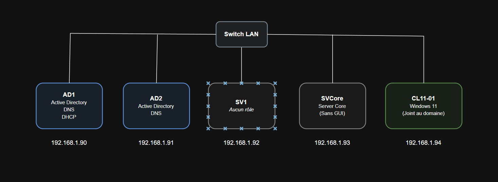

# Windows Server 2019 Administration Lab

## Présentation

Ce projet consiste à concevoir, déployer et administrer une infrastructure
Windows Server 2019 composée de deux contrôleurs de domaine, de deux serveurs
membres et d'un poste client Windows 10.

L'objectif est de mettre en pratique l'administration d'un environnement
Microsoft Windows comprenant Active Directory, DNS, DHCP, les stratégies de
groupe et l'administration avec PowerShell.

## Objectifs

- Installer et configurer Active Directory Domain Services
- Déployer et administrer le service DNS
- Installer et configurer un serveur DHCP
- Gérer les utilisateurs, groupes et unités d'organisation
- Configurer et tester des stratégies de groupe
- Mettre en place un second contrôleur de domaine
- Comprendre la réplication Active Directory
- Administrer Windows Server avec PowerShell
- Configurer et administrer Windows Server Core
- Réaliser et comprendre le clonage de machines virtuelles

## Architecture

## Machines du laboratoire

| Machine | Système d'exploitation | Rôle |
|---|---|---|
| AD1 | Windows Server 2019 | Contrôleur de domaine principal, DNS |
| AD2 | Windows Server 2019 | Contrôleur de domaine secondaire, DNS |
| SV1 | Windows Server 2019 | Serveur membre, DHCP |
| SRVCore | Windows Server 2019 Core | Administration sans interface graphique |
| CL10-01 | Windows 10 | Poste client du domaine |

## Technologies utilisées

- Windows Server 2019
- Windows 10
- Active Directory Domain Services
- DNS
- DHCP
- Group Policy
- PowerShell
- Windows Server Core
- VirtualBox / VMware / Hyper-V

## Documentation

La documentation détaillée est disponible dans le dossier [`docs`](docs/).

## Compétences démontrées

- Administration Active Directory
- Gestion des services DNS et DHCP
- Gestion des utilisateurs et des droits
- Configuration de GPO
- Administration distante
- Automatisation avec PowerShell
- Diagnostic et résolution d'incidents
