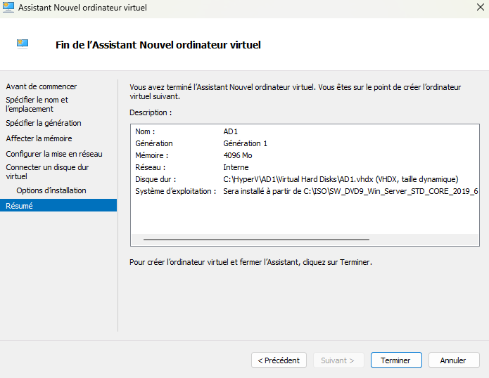
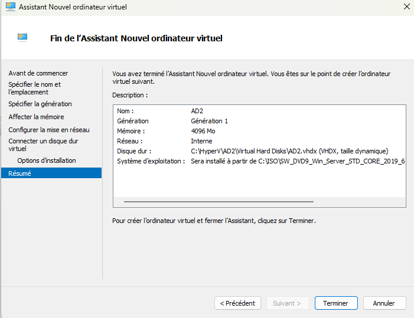
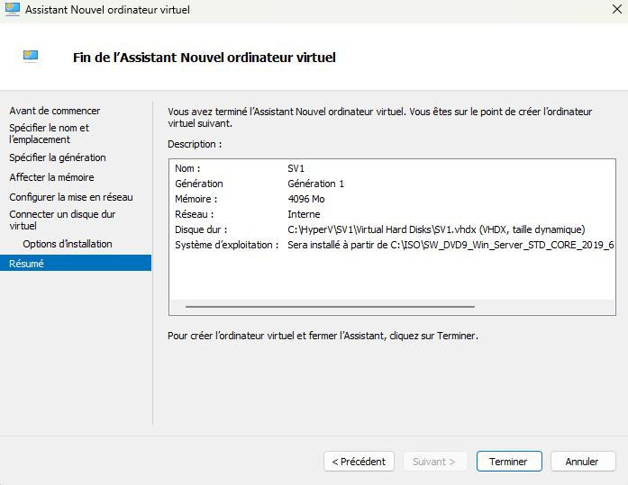
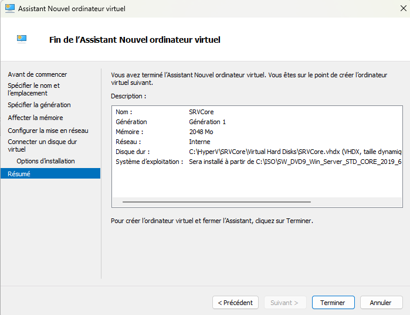
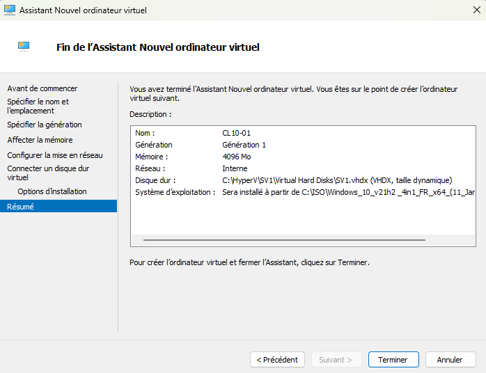

L'installation des differents serveur est effectué sur l'hyperviseur Hyper-V

Voici la configuration de AD1 :

Voici la configuration de AD2 :

Voici la configuration de SV1 :

Voici la configuration de SRVCore :

Voici la configuration de Cl10-01 :

