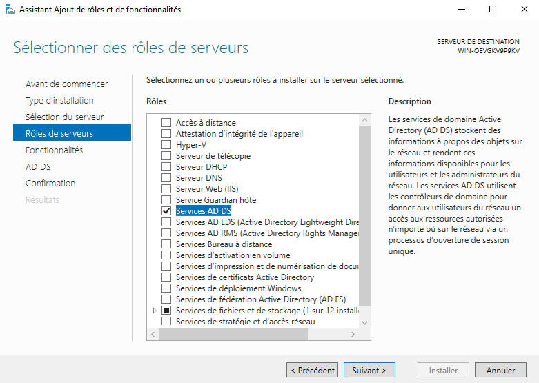
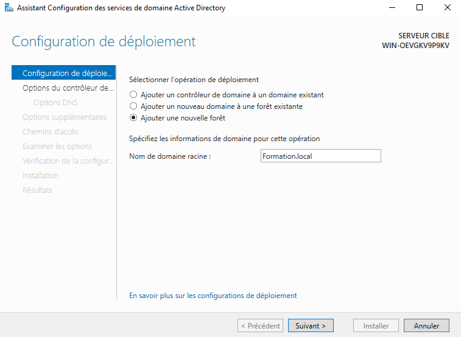

# ** Ajout du role AD-DS sur AD1 **
Pour commencer nous allons ajouter le role AD-DS sur AD1 :

Cela va nous permette de pouvoir :
- Stocker les comptes utilisateurs, les groupes, les machines
- Gèrer la sécurité, les stratégies de groupe (GPO), l’authentification Kerberos
- Et de créer une forêt, un domaine, des OU

Une fois la fonctionnalité ajouter, nous pouvons cliquer sur le drapeau et sur "Promouvoir ce serveur en controleur de domaine"
Nous allons ensuite crée une nouvelle foret que nous appelrons Formation.local :

Ensuite suiver les etape suivant et a la fin  de l'installation le serveur rédmarrera
